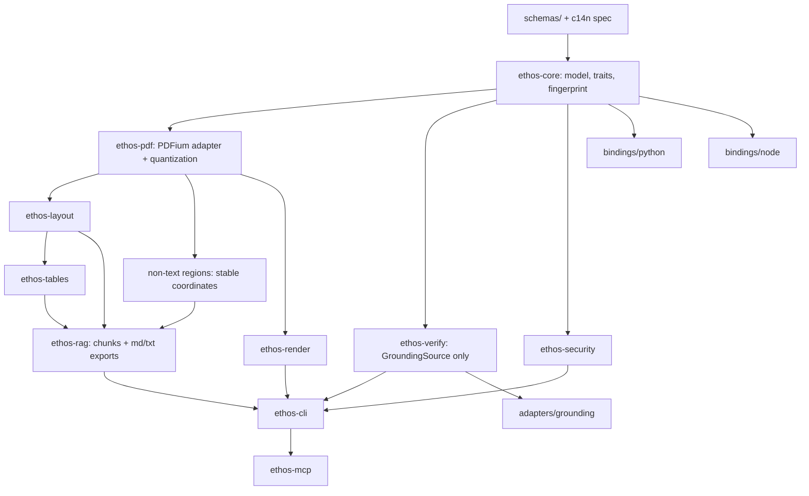

# Ethos - Implementation Plan

Status: v2.3 - trust-layer-first sequencing after ADR-0007; reduced-staffing schedule after ADR-0001; updated against PRD v3.5 (OSS-only); supersedes v2.2 where changed
Date: 2026-06-12
Source of truth: the Ethos OSS product requirements document in this docs directory (**PRD v3.5 OSS-Only**). Where this plan and the PRD conflict, **the PRD wins**; raise an ADR to change either. Every task carries its governing v3.5 section.
Scope rule (PRD preamble, 14): this plan is **Ethos OSS-only**. Hosted/platform integration, commercial packaging, and consuming-platform rollout are out of scope. Nothing in this plan depends on any platform.
Method: contract-first architecture discipline (senior-architect); execution as a multi-agent workflow with explicit patterns, bounded handoffs, validation gates, and failure paths (agent-workflow-designer).
Plan-level constructs: week numbers, checkpoint dates, and staffing assumptions are **plan commitments, not PRD requirements** - amend them here by PR with maintainer sign-off. ADR-0001 accepted reduced staffing and replaces the v2.1 week-4/13/26 schedule with the v2.2 week-8/22/40 schedule below.
Current execution status, blockers, and active lane acceptance criteria live in `docs/execution-status.md`.
Architectural principle (ADR-0007): Ethos is a verification and grounding layer that includes a
deterministic parser, not a parser that may later add verification.

---

## 1. Operating Model

### 1.1 Workflow pattern selection

- **Milestone A (weeks 1-8)** is an **orchestrator + serialized critical path** workflow with one **evaluator gate** (Gate Zero, PRD 1.3). Contracts/schemas land first, then engine and harness move through bounded handoffs. Milestone A is incomplete unless the trust boundary is real: `GroundingSource`, verification report/config schemas, an OpenDataLoader grounding adapter stub, and an `ethos verify` CLI stub must exist even if parser work is still advancing. The only allowed parallelism is one implementation lane plus lightweight benchmark/devrel support; the accepted staffing cannot safely run three implementation lanes.
- **Milestones B-E** run as **orchestrator** with bounded parallel lanes per crate, each gated by **evaluator loops** (fixtures-first, determinism CI, schema-compat - PRD 11.3, 14). Milestone B starts with verification alpha before broad parser/layout expansion.
- **Gate Zero G2/G3 failure** triggers a pre-scoped **router branch**: stop parser-core expansion and continue `ethos-verify` + chunk/citation tooling as a **standalone, parser-agnostic OSS layer over foreign parser output** (PRD 1.3). **G1-only failure** gets exactly one decider-owned choice: immediate fallback or one bounded remediation retry by week 10. This is a trust-layer pivot, not an OpenDataLoader fork - ODL JSON is simply the *first* grounding adapter; LiteParse and Docling adapters follow if useful (PRD 1.5, 2.1, 5.4). Salvage list in 6.5.

What we deliberately do NOT do: one mega-agent building the whole workspace (context bloat, unreviewable diffs), or per-file agents (handoff overhead exceeds work). The unit of agent work is a **crate or contract**; the unit of handoff is an **artifact** (schema file, fixture set, harness JSON, ADR), never freeform context.

### 1.2 Roles vs. headcount

Accepted ADR-0001 staffing (not in PRD v3.5): 1 senior Rust engineer + 0.25 benchmark/devrel, part-time. This replaces the v2.1 assumption of 2 senior Rust engineers + 1 bindings/infra engineer + 0.5 benchmark/devrel, dedicated. Lanes are **work lanes, not headcount**; humans own review/merge and the Gate Zero decision. Review capacity caps parallelism at 1 active implementation lane plus lightweight benchmark/devrel support. Release-2-horizon scope sheds first; Node beta/MCP experimental work requires either a staffed bindings/infra owner or an explicit release-scope ADR before public claims.

### 1.3 Branch and isolation discipline

- One git worktree/branch per active lane (`ws/<lane>-<milestone>`), merged via PR only.
- Every PR passes: schema validation, fixture suite, same-platform double-parse byte-diff (3-platform from CI availability), clippy/fmt/deny, and the PRD 14 agent rules (no "#1"/"best-in-class" claims, no OCR/VLM deps in base, fixtures before heuristics).
- Contracts (schemas, c14n spec, error/warning codes - PRD 8, 10) change only via PR labeled `contract-change` with a version bump (PRD 5.1: output-changing heuristics are semver events).

---

## 2. Week 0 - Pre-Kickoff (blocking; the clock does not start until all are done)

| # | Item | Owner | Output | PRD |
| --- | --- | --- | --- | --- |
| 0.1 | Record **Gate Zero decider**: Gate Zero decider, project lead | Maintainers | `docs/decisions/ADR-0000-gate-zero-decider.md` | 1.3, 15 |
| 0.2 | Confirm staffing matches 1.2 plan assumption, or recompute the schedule | Decider | ADR-0001 | plan-level |
| 0.3 | Freeze **Gate Zero corpus + hardware profile**. Corpus owner: Gate Zero decider interim, transferring to benchmark/devrel when staffed. Benchmark hosts: local Mac M4 Pro arm64 plus Linux x64 machines, with exact CPU/RAM/OS/kernel/runner strings recorded only in `benchmarks/gate-zero/manifest.json`. | Benchmark owner | `benchmarks/gate-zero/manifest.json` (per-file sha256; declared subsets incl. `born_digital`; hardware specs) - decider sign-off | 1.3 |
| 0.4 | Record **ADR-0002 PDFium two-phase path**: Phase 1 for Milestone A/Gate Zero uses pinned `bblanchon/pdfium-binaries` V8/XFA-disabled binaries by exact version + per-platform hash; Phase 2 by Milestone E uses project-maintained builds from `pdfium.googlesource.com` with pinned revision, flags, toolchain, patches. Public Beta is blocked on Phase 2. | Infra | ADR-0002 | 6.1, 15 |
| 0.5 | Record **ADR-0003 deterministic font policy**: embedded fonts first; missing-font -> `font-substitution-table.json` -> bundled Liberation family (SIL OFL 1.1, about 4 MB); glyph miss -> deterministic `.notdef` + warning; non-embedded CJK out of R1 with warning; PDFium mapper overridden to bundle. | Rust lead | ADR-0003 + font profile fixture | 6.1, 15 |
| 0.6 | Record **ADR-0004 licensing**: Apache-2.0 core; DCO with CI sign-off; cargo-deny allowlist Apache-2.0/MIT/BSD-2-3/ISC/Zlib/Unicode-DFS/CC0/MPL-2.0; GPL/AGPL/LGPL/custom-condition denied in base including optional defaults; exceptions by ADR only; NOTICE for PDFium BSD-3 and Liberation OFL. | Legal | ADR-0004 + `deny.toml` policy draft | 12 |
| 0.7 | CI matrix bootstrapped: macOS arm64 and Linux x64 Gate Zero hosts; Windows x64 determinism joins nightly no later than Milestone B exit, week 14; Linux arm64/macOS x64 build-only where available | Infra | `.github/workflows/` skeleton green on empty workspace | 1.3, 11 |
| 0.8 | Pin Gate Zero competitor versions: **OpenDataLoader, EdgeParse, LiteParse, PyMuPDF4LLM** (exact versions + hashes) | Benchmark owner | `benchmarks/competitors.lock.json` | 1.3, 11.2, 16 |
| 0.9 | Seed `docs/landscape-log.md` (June 2026 validation + 14 watchlist incl. LiteParse, Kreuzberg) | Devrel | landscape-log.md | 2 |
| 0.10 | Repo governance and hygiene: SECURITY.md, CONTRIBUTING.md (DCO), CODE_OF_CONDUCT.md, GOVERNANCE.md, maintainer ladder, honest-scope README draft (12 text), fixture contribution guide, public roadmap/discussion-channel plan, issue templates, triage SLO | Devrel | files in repo root + `docs/roadmap.md` | 12 |
| 0.11 | **Ethos package-name registry/trademark validation due by Milestone A exit**: `ethos` CLI, `ethos-doc`, `ethos-rag`, `ethos-verify`, `ethos-pdf` (PyPI), `@ethos-pdf/core` (npm), `ethos-*` (crates.io). Reserve `ethos-doc` and `ethos-rag` even if they remain facade modules. Project name is Ethos; package identifiers may change by ADR if unavailable. | Devrel | ADR-0006 (package identifiers) before A exit | 3.1, 15 |

Week 0 exit: all eleven rows done. 0.1-0.3 are hard blockers for Gate Zero validity (PRD 1.3: corpus changes after kickoff void the measurement). 0.10-0.11 are launch-trust blockers: do not publish packages, public benchmarks, or launch announcements before governance and naming decisions exist.

---

## 3. Repository Scaffold (first commit series)

### 3.1 Public Architecture

Ethos' public architecture is intentionally smaller than its internal crate graph:

```text
Ethos
├── ethos-doc
│   Document parsing, structure, and canonical document graph
│
├── ethos-rag
│   Chunking, citation references, and retrieval-ready artifacts
│
└── ethos-verify
    Evidence, grounding, fingerprint, and citation verification
```

Implementation mapping:

| Public module | Internal crates/workstreams | Release 1 output |
| --- | --- | --- |
| `ethos-doc` | `ethos-core`, `ethos-pdf`, `ethos-layout`, `ethos-tables`, `ethos-security`, `ethos-render`, WS-CONTRACTS, WS-ENGINE, WS-LAYOUT, WS-TABLES-RAG, WS-SECURITY, WS-OVERLAY | Canonical graph, Markdown/text exports, security report, debug overlay, stable document fingerprints. |
| `ethos-rag` | `ethos-rag`, WS-TABLES-RAG, WS-PUBLISH examples | Chunks, source refs, page/element/bbox citation artifacts, lightweight LangChain/LlamaIndex examples. |
| `ethos-verify` | `ethos-verify`, `adapters/grounding`, WS-VERIFY-ALPHA, WS-VERIFY | Verification reports, capability warnings, stale fingerprint checks, foreign-parser grounding adapters. |

CLI documentation should follow the public module shape: `ethos doc ...`, `ethos rag ...`, and `ethos verify ...`. Lower-level crate names remain internal engineering boundaries unless a package is explicitly published.

Use "document parsing and structure" for Release 1 `ethos-doc` messaging. Do not use broad "document understanding" language unless the text clearly says OCR/VLM understanding is outside Release 1.

### 3.2 Internal Scaffold

Target layout (PRD 5.2, annotated with the milestone that fills each path; package names provisional per 3.1):

```text
ethos/
  Cargo.toml                  # workspace, lockstep versioning [A]
  rust-toolchain.toml         # pinned toolchain (same compiler everywhere) [A]
  deny.toml                   # cargo-deny: licenses, advisories, dep policy [A]
  clippy.toml                 # disallowed network APIs in base crates (4 invariant 5) [A]
  crates/
    ethos-core/                # [A] canonical model, IDs, errors, schema types, traits, c14n + fingerprint
    ethos-pdf/                 # [A] PDFium backend behind EthosPdfBackend; quantize-at-extraction lives HERE (5.3.3)
    ethos-layout/              # [B] reading order, blocks, headings, lists
    ethos-tables/              # [C] table detection + structure
    ethos-rag/                 # [C] chunking, citation model, exporters (md/txt/chunks.jsonl)
    ethos-security/            # [C] hidden/off-page/annotation/action report
    ethos-verify/              # [B alpha, D v1] parser-agnostic via GroundingSource only (1.5, 5.4)
    ethos-render/              # [C] crops, overlays
    ethos-cli/                 # [A skeleton, grows each milestone] binary: `ethos`
    ethos-mcp/                 # [D/E conditional] MCP experimental only if staffed or accepted by release-scope ADR; GA candidate in Release 2
    ethos-layout-ml/           # [F / Release 2] optional, never base
  bindings/
    python/                   # [B scaffold, E stable] PyO3/maturin -> package `ethos-pdf`, import `ethos_pdf`
    node/                     # [D/E conditional] napi-rs -> `@ethos-pdf/core` if staffed or accepted by release-scope ADR
    wasm/                     # [Release 2-or-later spike, 15]
  adapters/
    grounding/                # [A stub, B alpha, D v1] opendataloader-json first; liteparse/docling-json later if useful
    docling/  unstructured/  eval/                            # [post-E, Release 2 horizon]
    langchain/  llamaindex/                                    # [E examples first; maintained adapters later]
  schemas/                    # [A] document, chunks, security-report, verification-report, verification-config
  profiles/                   # [A] ethos-deterministic-v1.json profile artifact
  fixtures/                   # [A->] public/ synthetic/ security/ failure/
  benchmarks/
    gate-zero/manifest.json   # [Week 0, frozen]
    harness/                  # [A] runner + competitor adapters (ODL, EdgeParse, LiteParse, PyMuPDF4LLM)
    competitors.lock.json     # [Week 0]
  docs/
    <Ethos OSS product requirements>              # PRD v3.5 (present)
    IMPLEMENTATION_PLAN.md    # this file
    architecture.md  determinism-contract.md  pdfium-profile.md  benchmark-plan.md  landscape-log.md   # [A / Week 0]
    decisions/                # ADR-0000...
  .github/workflows/          # [Week 0->A] ci.yml, determinism.yml, bench.yml, release.yml
```

Scaffold rules: contracts before code - `schemas/` + `docs/determinism-contract.md` merge before any crate that serializes output; `ethos-verify` never imports Ethos-internal types (PRD 5.1, 14); OCR/VLM/ML deps and restricted-license dependencies are banned from base features (PRD 5.1, 4.3, 12).

---

## 4. Architecture Build Order



Architectural invariants enforced from commit one:

1. **Quantize-at-extraction** - deterministic geometry quantization happens in `ethos-pdf` before layout/table/chunk/reading-order heuristics consume coordinates (PRD 5.3, normalize stage). Enforced by type: extraction emits `QuantizedGeom`, never raw `f64` tuples.
2. **Canonical payload vs envelope** - one c14n implementation in `ethos-core`; runtime diagnostics sit outside canonical equality (PRD 8); no crate hand-rolls output JSON.
3. **Backend isolation** - only `ethos-pdf` links PDFium; `EthosPdfBackend` is the sole boundary; public schemas/APIs never expose PDFium types (PRD 6.2); sandbox/subprocess mode is a backend impl (PRD 6.3).
4. **Verify portability** - `ethos-verify` compiles against `GroundingSource` alone (PRD 5.4, 14); CI proves it by building the crate against the trait module only.
5. **No network in base** (PRD 5.1, 10) - enforced in **three layers**: (a) dependency policy - cargo-deny + a reviewed allowlist; any new dependency with network capability (`reqwest`, `hyper`, `ureq`, `curl`, socket-bearing crates) is rejected for base crates in review; (b) static checks - clippy `disallowed-types`/`disallowed-methods` for `std::net::*`, `TcpStream`, `UdpSocket` in base crates; (c) runtime proof - CI executes the CLI under a network-denying sandbox and asserts zero egress. cargo-deny alone does not catch direct `std::net` use; that is what layer (b) is for.
6. **License boundary in base** (PRD 12) - cargo-deny denies GPL, AGPL, source-available, custom-condition, or model-license-restricted dependencies in the base dependency tree. Optional OCR/VLM/layout-ML integrations live behind explicit non-default features or separate packages with generated license manifests.

---

## 5. Workstream & Agent Design

### 5.1 Lane roster

| Lane | Scope | Inputs (context budget) | Outputs (handoff artifacts) | Active |
| --- | --- | --- | --- | --- |
| **WS-CONTRACTS** | schemas/, c14n spec, deterministic profile artifact, determinism contract, error/warning codes (10), fingerprint in `ethos-core` | PRD 8, 10 | `schemas/*.json`, `profiles/ethos-deterministic-v1.json`, `docs/determinism-contract.md`, `ethos-core` | A |
| **WS-ENGINE** | PDFium spike: canonical-source build (V8/XFA off), font mapper override, quantization, page-range-filtered extraction, sandbox feasibility | PRD 6; ADR-0002/0003 | `ethos-pdf`, `docs/pdfium-profile.md`, font bundle + substitution table, spike report | A |
| **WS-HARNESS** | harness, competitor adapters (ODL, EdgeParse, **LiteParse**, PyMuPDF4LLM), CI matrix, G1/G2/G3 jobs; later quality dashboard support | PRD 11, 1.3; manifest; competitors.lock | `benchmarks/harness/`, `determinism.yml`, `bench.yml`, gate JSON | A; B evaluator support |
| **WS-LAYOUT** | reading order, blocks, headings, lists; **Markdown + text exporters** | PRD 4.1, 5.3, 7 | `ethos-layout`, exporters, labeled fixtures | B |
| **WS-TABLES-RAG** | simple/bordered tables, cell model; chunker (`chunks.jsonl`), citations; **non-text region detection with stable coordinates** | PRD 4.1, 5.3, 7, 8 | `ethos-tables`, `ethos-rag`, region detector, chunk fixtures | C |
| **WS-OVERLAY** | render, crops, debug HTML overlay with click-to-highlight | PRD 4.1, 7, 13-C | `ethos-render`, `ethos debug`, demo assets | C |
| **WS-SECURITY** | hidden/off-page/low-contrast, annotations/actions/attachments/scripts/links; security report; default-chunk exclusion | PRD 4.1, 8, 10 | `ethos-security`, `security_report.json`, security fixtures | C |
| **WS-VERIFY-ALPHA** | early trust layer: A-stage ODL adapter stub, then `ethos verify` alpha, verification report/config schema, capability downgrades, foreign-parser demo | PRD 1.5, 5.4, 8 | `adapters/grounding/opendataloader-json` stub in A; `ethos-verify` alpha and demo fixture in B | A stub, B alpha |
| **WS-VERIFY** | harden verify engine to v1, add crop-aware L2 evidence plumbing, expand adapter tests | PRD 5.4, 8 | `ethos-verify` v1, adapter test fixtures, `ethos verify` docs | D |
| **WS-SURFACES** | Python binding scaffold (B) and stable CLI/Python packaging (E); **functional Node binding (beta)** + **MCP server (experimental) with 9.4 security rules** only if staffed or accepted by release-scope ADR | PRD 9 | `ethos-pdf` wheels; conditional `@ethos-pdf/core`, `ethos-mcp` | B, D/E |
| **WS-PUBLISH** | internal benchmark snapshots (A-D), **public benchmark report + proof-of-trust demos + stable CLI/Python docs at E only**, README, landscape log | PRD 11.3, 11.4, 12, 13-E | publications, README, demos, ecosystem examples | A->E |
| **WS-FALLBACK** (dormant) | fallback packaging posture: standalone `ethos-verify` + chunk/citation tooling over foreign parser output if parser-core stops | PRD 1.3, 1.5; Gate Zero ADR | activates on G2/G3 failure, G1 retry failure, or decider fallback | - |

### 5.2 Handoff contracts (every edge, explicit and bounded)

1. **WS-CONTRACTS -> all lanes:** versioned `schemas/*.json` + published `ethos-core` types; consumers pin schema versions; changes via `contract-change` PR + downstream sign-off. Payload: file paths + changelog entry, never prose.
2. **WS-ENGINE -> WS-LAYOUT:** `QuantizedGeom` extraction API + 20 extraction golden fixtures. Acceptance: identical fingerprints on 3 platforms.
3. **WS-ENGINE -> WS-HARNESS:** CLI parse entrypoint with stable 10 exit codes + `ethos fingerprint`. Acceptance: harness runs Ethos unattended.
4. **WS-HARNESS -> decider:** `benchmarks/results/gate-zero/{g1,g2,g3}.json` + reproduction command + hardware attestation - the decider's only input (PRD 1.3).
5. **WS-LAYOUT -> WS-TABLES-RAG:** element-graph fixtures (multi-column, lists, headings) with reading-order ground truth.
6. **WS-CONTRACTS -> WS-VERIFY-ALPHA:** `GroundingSource` trait (frozen at A exit) + verification schemas; verify lanes never see parser internals (4 invariant 4).
7. **WS-VERIFY-ALPHA -> WS-VERIFY / WS-SURFACES:** alpha report schema, ODL adapter behavior, and capability warnings become the v1 hardening input; MCP tools wrap the hardened API 1:1 (PRD 9.4).
8. **Any lane -> WS-PUBLISH:** numbers only via harness JSON (PRD 11.3: published tables come from one-command reproduction).

### 5.3 Validation gates (evaluator loops)

- **Per-PR:** schema-validate -> c14n idempotence property tests -> deterministic profile validation -> fixtures -> same-platform double-parse byte-diff -> clippy/deny/network-lints -> no-network base check. Red = no merge.
- **Cross-platform (nightly + `contract-change` PRs):** Gate Zero platform fingerprint equality on macOS arm64 and Linux x64 first; Windows x64 joins nightly determinism no later than Milestone B exit, week 14. Windows failures before Public Beta are release-blockers-in-waiting. This makes Gate Zero and beta hardening measurements, not surprises.
- **Fixtures-first (PRD 14):** heuristic PRs ship fixtures in the same PR; reviewers reject otherwise.
- **Gate Zero (week 8):** 6.4 below.
- **Milestone exits:** PRD 13 exit criteria checked as a checklist in the milestone-closing PR.

### 5.4 Failure handling & retries

- CI flake policy: auto-retry once; second failure is real. **Determinism failures are never retried into green** - a flaky fingerprint IS the bug (PRD 14).
- Lane >1 week late or idle under the reduced-staff schedule -> re-scope at the twice-weekly check-in; Release-2-horizon scope sheds first, then optional/unstaffed surfaces.
- G2/G3 Gate Zero failure -> WS-FALLBACK activates (6.5); parser-core expansion stops (PRD 1.3). G1-only failure with G2/G3 pass gets exactly one decider ADR branch: immediate fallback or a bounded week-10 retry. No other partial-credit path exists.
- Competitor harness runs get timeouts + pinned versions; competitor crashes are recorded as data, not patched around (PRD 11.3).

---

## 6. Milestone A - Weeks 1-8 (Gate Zero, PRD 1.3, 13-A)

### 6.1 WS-ENGINE (critical path)

| Week | Tasks | Acceptance | PRD |
| --- | --- | --- | --- |
| 3-4 | Integrate **Phase 1 PDFium**: pinned `bblanchon/pdfium-binaries` V8/XFA-disabled artifacts by exact version and per-platform hash for Gate Zero. Record that the archived GitHub mirror is not source of truth and that Phase 2 project-maintained builds from `pdfium.googlesource.com` block Public Beta. | Builds load on Gate Zero hosts; exact version + hashes recorded in `docs/pdfium-profile.md`; Public Beta blocker recorded | 6.1 |
| 4 | Quirk validation on gate manifest subset: ligatures, hyphenation, CID fonts, rotation | Quirk report; blocking quirks escalated to decider by week 4 exit | 6.1 |
| 4-5 | **Font mapper override**: embedded fonts first; `font-substitution-table.json`; bundled Liberation fallback; system-font fallback disabled; glyph miss -> deterministic `.notdef` + warning; non-embedded CJK warns as out of Release 1 | Same missing-font fixture -> identical spans on Gate Zero platforms | 6.1 |
| 5-6 | **Quantize-at-extraction** (`QuantizedGeom`); coordinate/rotation normalization; page/span extraction with **page-range filtering at the backend boundary** (Release 1 requirement) -> schema via c14n | Extraction goldens - including page-subset fixtures - byte-identical across Gate Zero platforms | 4.1, 5.3 |
| 6 | Stable error codes: corrupt/encrypted/password/image-only; resource limits | 10 codes on failure fixtures | 10 |
| 6-7 | Sandbox/subprocess feasibility: narrow IPC sketch, rlimits, perf delta | Feasibility report (build-out lands in D for service-deployment mode) | 6.3 |
| 7-8 | Perf pass for G1: profile, batch page iteration | G1 measurement run | 1.3 |

### 6.2 WS-CONTRACTS

| Week | Tasks | Acceptance | PRD |
| --- | --- | --- | --- |
| 1 | Contract package: all five schemas drafted (document, chunks, security-report, verification-report, verification-config) plus `profiles/ethos-deterministic-v1.json` | JSON Schema validates PRD 8 field lists and examples; deterministic profile artifact validates against its schema/checker | 8, 16 |
| 1-2 | `docs/determinism-contract.md`: c14n v1 algorithm, canonical exclusion table, deterministic profile manifest; `profiles/ethos-deterministic-v1.json` records c14n version, quantization, font policy ref, PDFium profile placeholder, warning policy, config-hash inputs, and excluded runtime fields | Property tests: c14n idempotence, exclusion correctness, key-order stability; profile round-trip stable | 8 |
| 2 | Fingerprint + profile manifest format (backend manifest hash incl. build flags, font profile hash, config hash, quantization) | Fingerprint stable across repeat runs | 6.1, 8 |
| 2-3 | `ethos-core` trait skeleton and types: `GroundingSource`, backend trait, layout trait, error enum, config; tiny `adapters/grounding/opendataloader-json` stub mapping parser identity, pages, elements, bbox, text, and capabilities into `GroundingSource` | CI proves `ethos-verify` and the ODL adapter stub compile/validate against the trait module alone with no parser-internal dependency | 5.4 |
| 3-4 | CLI skeleton: public command groups `ethos doc parse` (json/markdown/text) with **`--pages` range parsing** (`1-5,9` syntax; validated; stable error on out-of-range), `ethos rag chunk` placeholder over canonical JSON, `ethos verify` placeholder over verification schema, `ethos fingerprint`; `docs/architecture.md`. Page selection enters `config_sha256` - a different page range is a legitimately different canonical output | One command -> JSON+Markdown on simple fixtures; `--pages 1-5,9` yields a filtered, fingerprint-stable parse; command help exposes `doc`, `rag`, and `verify` groups | 4.1, 9.1, 16 |

### 6.3 WS-HARNESS

| Week | Tasks | Acceptance | PRD |
| --- | --- | --- | --- |
| 3-4 | Runner: timing (p50/p95/p99 cold+warm), peak RSS, install-size method incl. PDFium + font assets | Self-test on PyMuPDF4LLM | 11.1, 1.3 |
| 4-6 | Competitor adapters: ODL (JVM, pinned), EdgeParse, **LiteParse**, PyMuPDF4LLM; one-command reproduction | `make bench` reproduces full table incl. LiteParse | 11.2, 11.3 |
| 6 | `determinism.yml`: Gate Zero platform fingerprint-equality job on macOS arm64 and Linux x64 (nightly + contract-change PRs); Windows x64 matrix job planned and scheduled for Milestone B exit, week 14 | Green on extraction goldens by week 7; Windows runner plan documented | 1.3 |
| 7 | G1/G2/G3 measurement jobs emitting signed JSON + environment attestation | Dry run on week-7 build | 1.3 |
| 8 | **Gate Zero run** on frozen manifest | g1/g2/g3.json + repro commands to decider | 1.3 |

### 6.4 Gate Zero execution (week 8, days 38-40)

Protocol: harness host matches the frozen hardware profile; all gates measured against `benchmarks/gate-zero/manifest.json` and its declared subsets - one artifact, one name (PRD 1.3).

- **G1 - Throughput:** threshold = **max(120 pages/sec p50, 2x in-harness-remeasured OpenDataLoader pps)** on the manifest's `born_digital` subset, single core per host. G1 must pass independently on every recorded Gate Zero performance host in `benchmarks/gate-zero/manifest.json`; no averaging or host substitution is allowed. The PRD's 120 pps is a **floor** (1.3, 3.3); a low ODL remeasurement can never lower it. EdgeParse and LiteParse numbers are recorded alongside as context (non-gating). G1 failure alone cannot produce public speed claims and gets only the PRD-approved ADR branch below.
- **G2 - Footprint:** total installed footprint (CLI + dynamic libs + PDFium payload + schemas + font assets, bytes on disk, no network) <= 30 MB **and** <= 1/10 of measured ODL footprint. V8/XFA-enabled builds auto-fail (1.3, 6.1).
- **G3 - Determinism:** byte-identical canonical payload + equal fingerprints across Gate Zero supported platforms, at minimum macOS arm64 and Linux x64 on the **full frozen manifest**; font-mapper override and quantize-at-extraction implemented, not documented (1.3, 6.1). Windows x64 joins nightly determinism no later than Milestone B exit, week 14, and unresolved Windows divergence blocks or re-scopes Public Beta.

Decider records ADR-0005:

```
# ADR-0005: Gate Zero Decision
Date / Decider:
Inputs: benchmarks/results/gate-zero/{g1,g2,g3}.json @ commit <sha>, manifest <sha>
G1: <measured pps> vs max(120, 2x <ODL-measured>) -> PASS|FAIL
G2: <bytes> vs 30MB and <ratio> vs ODL -> PASS|FAIL
G3: <platforms, divergence count> -> PASS|FAIL
Decision: PROCEED (Milestone B) | G1_RETRY (bounded retry by week 10; corpus unchanged; no speed claim) | FALLBACK (6.5; parser-core expansion stops)
```

Decision rule: G2 or G3 failure always means FALLBACK. G1 failure with G2/G3 pass means the decider chooses either FALLBACK or G1_RETRY. A failed retry means FALLBACK.

### 6.5 Fallback charter (pre-scoped; parser-agnostic by design)

On G2/G3 failure, G1 retry failure, or decider-selected G1 fallback, Ethos pivots to the **trust layer** (PRD 1.3): standalone `ethos-verify` + chunk/citation tooling over foreign parser output. Survives: all five schemas; `ethos-verify` + `GroundingSource`; grounding adapters (ODL JSON first, LiteParse/Docling candidates next per 2.1); the harness + claims policy (repointed at verification benchmarks); c14n/fingerprint applied to verification reports. Dies: `ethos-pdf`, layout/tables lanes. **Not** an ODL fork: no fork is maintained; foreign parsers are consumed as pinned upstream dependencies through adapters. If parser-core proceeds, the trust layer still ships as Milestone B alpha.

---

## 7. Milestones B-C - Weeks 9-22 (plan-level first checkpoint)

### Milestone B (weeks 9-14): Verify Alpha, Then Layout And Exports (PRD 13-B)

| Lane | Deliverables | Acceptance (PRD 13-B exit) | PRD |
| --- | --- | --- | --- |
| WS-VERIFY-ALPHA | `ethos verify` alpha over `GroundingSource`: quote/presence citation checks over native Ethos JSON and OpenDataLoader-style JSON; stale fingerprint checks; capability-limited reports; deterministic evidence matching; public CLI demo `ethos verify odl.json --grounding opendataloader-json --citations answer.json` | Trust layer works over foreign parser output before parser-core expansion continues | 1.5, 5.4, 8 |
| WS-LAYOUT | Reading order, block grouping, heading/list inference; **Markdown + plain-text exporters** after the verify-alpha gate | Multi-column fixtures read correctly; md/txt useful for RAG | 4.1, 7 |
| WS-SURFACES | PyO3 binding scaffold + maturin local wheels: `ethos-pdf` / `ethos_pdf`; stable packaging hardens in E after the verify-alpha gate | Python package parses local PDFs on supported dev platforms | 9.2 |
| WS-HARNESS | Quality metrics: reading order, heading hierarchy, bbox IoU (evaluator support, not a fourth implementation lane) | Quality dashboard in `make bench` | 11.1 |

### Milestone C (weeks 15-22): Tables, Chunks, Regions, Security, Overlay (PRD 13-C)

| Lane | Deliverables | Acceptance (PRD 13-C exit) | PRD |
| --- | --- | --- | --- |
| WS-TABLES-RAG | Simple/bordered table detection + cell model; RAG chunker (`chunks.jsonl`) with page/element/bbox citations; **non-text region detection with stable coordinates** (no stable semantic image/chart/formula classification in R1) | Common tables retain structure; chunks cite source bboxes; non-text regions carry coordinates | 4.1, 7, 8 |
| WS-SECURITY | Hidden/off-page/low-contrast detection; annotations/actions/attachments/scripts/links; `security_report.json`; default-chunk exclusion | Hidden/off-page text excluded from default chunks | 4.1, 8, 10 |
| WS-OVERLAY | Crops + debug HTML overlay with click-to-highlight | Demo: select answer -> source bbox highlights | 4.1, 7 |
| WS-PUBLISH | **Internal alpha benchmark snapshot** (speed/weight/determinism vs ODL, EdgeParse, LiteParse, PyMuPDF4LLM) - **not a public release claim**; Release 1 is incomplete until D's verification v1 and E's surface/claim audit land (4.1) | Snapshot reproduces one-command; stays internal/dev-labeled | 11, 4.1 |

**First checkpoint (week 22, plan-level):** A-C complete. Miss -> decider reviews scope (shed Release-2-horizon items, re-plan D-E, or pivot posture) via ADR.

---

## 8. Milestones D-E - Weeks 23-40 (plan-level public-beta checkpoint)

### Milestone D (weeks 23-30): Agents And Verification (PRD 13-D)

| Lane | Deliverables | Acceptance (PRD 13-D exit) | PRD |
| --- | --- | --- | --- |
| WS-VERIFY | Harden Milestone B alpha to `verify_citations` v1: claim kinds, modes, per-check `semantic_unverified`, `all_evidence_grounded` per 8 definition, verification-config hash; ODL adapter hardening; capability downgrade warnings | Verification works over at least one foreign parser output with stable report schema | 5.4, 8 |
| WS-SURFACES | **Crop API** - `crop_element` exposed as a first-class deliverable across CLI/Python and any staffed beta/experimental surfaces, backed by the `ethos-render` crop primitive from Milestone C. **Functional Node binding labeled beta** (`@ethos-pdf/core`) and **MCP server labeled experimental** require either a staffed bindings/infra owner or an explicit release-scope ADR before public claims. | Stable CLI/Python can parse, chunk, cite, verify, and crop; Node/MCP either smoke-test with labels or are re-scoped before E | 9.3, 9.4, 13-D |
| WS-ENGINE | Sandbox/subprocess backend build-out for service deployments (rlimits + narrow IPC per 6.3) | Sandbox mode passes threat-model review | 6.3 |

### Milestone E (weeks 31-40): Public Beta (PRD 13-E) - first public claim

| Lane | Deliverables | Acceptance (PRD 13-E exit) | PRD |
| --- | --- | --- | --- |
| WS-PUBLISH | **Public benchmark report** vs ODL, EdgeParse, **LiteParse**, PyMuPDF4LLM + feasible others (Kreuzberg, Docling, MinerU, Marker, MarkItDown, Unstructured); OmniDocBench labeled neutral/community; ParseBench + competitor-owned suites labeled publisher-owned; tiers labeled; known Gate Zero host numbers paired with third-party reproducible cloud-runner numbers; honest-scope README per 12; proof-of-trust demos (RAG citations, agent verify+crop, foreign-parser verification) | Reproducible methodology; no "#1"/"best-in-class" anywhere; no laptop-only/local-host-only marketing numbers; launch demos run on pinned fixtures | 11.2, 11.3, 11.4, 12 |
| WS-SURFACES + WS-CONTRACTS | Stable CLI/Python docs; Node beta docs and MCP experimental docs only if staffed or accepted by release-scope ADR; lightweight LangChain/LlamaIndex examples over Python API; schema compatibility tests; determinism CI hardened; Windows x64 determinism green or release re-scoped; release artifacts for target platforms (footprint check as release gate); project-maintained PDFium Phase 2 builds from `pdfium.googlesource.com` with pinned revision, flags, toolchain, patches, and hashes | Users install stable CLI/Python, parse, inspect, chunk, verify born-digital PDFs; any Node/MCP status is explicit; Public Beta does not ship on Phase 1 PDFium binaries; unresolved Windows determinism divergence blocks or re-scopes Public Beta | 6.1, 13-E |
| Gate | **Release 1 claim audit**: every included 4.1 stable capability demonstrably present (Rust core, stable CLI, stable Python, canonical JSON, deterministic md, txt, chunks, page selection, rotation/coords, failure detection, spans, headings/lists/reading order, simple tables, non-text region coordinates, security report, verification report, parser-agnostic verification, debug overlay, crop API (`crop_element`, per 13-D), LiteParse-inclusive harness, launch examples); Node beta and MCP experimental either have smoke tests with explicit labels or are removed from public claims by ADR - checklist in the release PR | Public "Release 1" only after audit passes; optional surfaces are labeled or explicitly out of scope | 4.1, 11.4, 13-D |

**Public-beta checkpoint (week 40, plan-level):** A-E complete; public beta live. Milestone F (Release 2 enrichment: complex tables, formula/LaTeX, chart classification, optional enrichment modules - PRD 13-F) is scoped *after* E from fixtures gathered during beta. Platform/hosted adoption is out of scope here.

---

## 9. CI/CD Design

| Workflow | Trigger | Jobs |
| --- | --- | --- |
| `ci.yml` | every PR | fmt, clippy (incl. disallowed network APIs), cargo-deny (license/advisory/dep-allowlist, deny copyleft/custom-condition deps in base), unit+fixture tests, schema validation, deterministic-profile validation, c14n idempotence property tests, same-platform double-parse byte-diff, no-network base check |
| `determinism.yml` | nightly + `contract-change` PRs | Gate Zero platforms first (macOS arm64 + Linux x64) -> parse fixtures -> fingerprint + canonical-payload comparison -> fail on any divergence; Windows x64 added no later than Milestone B exit, week 14; unresolved Windows divergence blocks or re-scopes Public Beta (PRD 14) |
| `bench.yml` | weekly + tags | harness vs pinned ODL/EdgeParse/LiteParse/PyMuPDF4LLM; uploads results JSON + repro attestation; never prose claims |
| `release.yml` | tags | reproducible builds, pinned toolchain; `ethos` CLI, `ethos-pdf` wheels, `@ethos-pdf/core` beta npm only if staffed or accepted by release-scope ADR; project-maintained PDFium Phase 2 builds required for Public Beta; fonts bundled; <= 30 MB footprint release gate for the stable base surface; profile manifest (flags, hashes, provenance) and third-party license/NOTICE manifest published with artifacts |

Release engineering: lockstep workspace versions; output-changing merges bump versions with CHANGELOG (PRD 5.1); artifacts content-addressed in the profile manifest (PRD 6.1); network-egress runtime test runs in `ci.yml` (4 invariant 5c).

## 10. Test Strategy (detail in docs/benchmark-plan.md)

- **Golden fixtures** per pipeline stage (extraction spans, layout graphs, tables, regions, chunks) - fixtures-first enforced in review (PRD 14).
- **Property tests:** c14n idempotence; deterministic-profile round-trip stability; quantization stability (parse == parse(parse) (idempotent re-serialization)); chunker never splits table rows; canonical payload contains no runtime/diagnostic field (PRD 8).
- **Determinism:** double-parse diff per PR; Gate Zero platform fingerprint equality nightly; Windows x64 by Milestone B exit, week 14; verification-report determinism.
- **Security suite:** hidden/off-page/white-on-white, annotations/actions/attachments/scripts/links - assert surfacing + default-chunk exclusion; warning precision/recall tracked (PRD 10, 11.1).
- **Failure suite:** corrupt, encrypted, password, image-only, oversized, rotated - stable 10 codes, never panics; cargo-fuzz on `ethos-pdf` ingest from Milestone B.
- **Compat tests:** schema round-trip CLI/Python stable surfaces; Node beta and MCP experimental smoke tests when included, with labels enforced (PRD 13-E).

## 11. Risk Register

| # | Risk | L/I | Mitigation | Trigger -> Action |
| --- | --- | --- | --- | --- |
| R1 | PDFium font substitution breaks G3 | M/Critical | Font-mapper override + bundled set by week 5; cross-platform substitution test | Week-5 test red -> escalate to decider |
| R2 | FP divergence across platforms despite quantization | M/Critical | Quantize-at-extraction by type; nightly Gate Zero-platform diff from week 6 | Divergence found -> pin/patch backend build (PRD 6.1), never document around |
| R3 | G1 floor missed | M/High | Profile week 7; PDFium batch APIs; trust layer already active in B | G1 fail + G2/G3 pass -> decider chooses fallback or one bounded retry by week 10; retry fail -> 6.5 trust-layer pivot |
| R4 | G2 blows 30 MB (PDFium + fonts) | L-M/High | V8/XFA-off build; minimal font set; strip+LTO; weekly measurement | >30 MB at week 7 -> font diet or decider call |
| R5 | **LiteParse (run-llama) ships verification/fingerprint contract first** - LiteParse is corporate-backed and the closest Release 1 overlap (PRD 2.1); EdgeParse remains tracked but lower-weight unless community signal changes | M/High | Landscape log monthly (PRD 2); verify wedge lands as B alpha and D v1; differentiation checklist from 2.1 tracked per milestone | Wedge claimed -> re-review before next milestone; if trust layer is matched, 2.1 redundancy warning applies |
| R6 | Staffing below original plan assumption | High/High | ADR-0001 accepted; v2.2 serial schedule; Release-2-horizon and optional/unstaffed surfaces shed first | Critical lane idle >1 wk -> re-scope at check-in; Node/MCP before trust layer |
| R7 | Sandbox IPC overhead hurts service throughput | M/Medium | Feasibility spike in A measures delta; worker reuse | >15% overhead -> amortize + document modes |
| R8 | Package-name collision/trademark (`ethos` is a loaded name) | M/Medium | Week-0 registry/trademark scan (0.11); names provisional per PRD 3.1 | Conflict -> rename via ADR-0006 before any public artifact |
| R9 | Cross-platform CI runner availability, especially Windows x64 by Milestone B exit | L/Medium | Week-0 bootstrap for Gate Zero hosts; Windows determinism joins nightly by week 14; self-hosted fallback budgeted | Windows gap by Milestone D -> block or re-scope Public Beta, never waive determinism claim |
| R10 | Public failure-corpus process stalls (wedge #4 stays unearned) | M/Low (R1 horizon) | Fixture contribution guide at Week 0 (PRD 12); public fixtures only - no claims until earned (PRD 1.4) | Stall -> wedge #4 stays out of all marketing; no schedule impact |
| R11 | Trust wedge arrives too late and Ethos is dismissed as yet another parser | M/Critical | ADR-0007 makes trust-layer-first non-optional; WS-VERIFY-ALPHA leads Milestone B; parser/layout expansion waits behind quote/presence verification over native Ethos JSON and ODL JSON | Verify alpha misses B exit -> decider cuts optional surfaces and parser breadth first, not the trust layer |

## 12. Governance, Reporting, Change Control

- **ADRs** in `docs/decisions/` for every closing 15 open question; Gate Zero ADR-0005 per 6.4 template; output-changing merges reference CHANGELOG entries (PRD 5.1).
- **Cadence:** twice-weekly orchestrator check-in (lane status vs handoff dates); weekly tracker vs week-8/22/40 anchors; landscape refresh before each milestone and at least every 90 days (PRD 2) - watchlist per 14 including LiteParse and Kreuzberg.
- **Governance metrics after public launch:** median first issue response under 48 hours, OpenSSF Scorecard tracked monthly, good-first-issue funnel reviewed monthly, and trust-loop activation tracked from documented examples/download telemetry where privacy-safe.
- **Claims discipline in-repo** (PRD 11.3, 14, 1.4): CI grep-gate blocks "#1", "best-in-class", "pixel-level proof", "semantic proof", and unearned failure-corpus advantage claims in README/docs/announcements.
- **Plan changes:** amended by PR; gates, the reduced-staff schedule, or Release 1 scope require decider sign-off.

## 13. Pre-Kickoff Decision Audit (PRD 15 - blocking subset)

Closed decisions to record as ADR/files before coding starts: 1. Gate Zero decider Gate Zero decider (-> ADR-0000). 2. Staffing differs from the original plan and v2.2 reduced-staff schedule is accepted (-> ADR-0001). 3. PDFium two-phase path: Phase 1 pinned bblanchon binaries for Gate Zero, Phase 2 project-maintained builds before Public Beta (-> ADR-0002). 4. Deterministic font policy: embedded fonts, substitution table, Liberation fallback, deterministic `.notdef`, non-embedded CJK warning (-> ADR-0003). 5. Legal: Apache-2.0 core, DCO CI sign-off, license allowlist/deny policy, NOTICE obligations (-> ADR-0004). 6. Gate Zero corpus + hardware manifest frozen and signed by project lead as interim corpus owner. 7. Ethos package identifiers registry/trademark validation due by Milestone A exit, week 8 (-> ADR-0006). 8. Governance docs + triage SLO ready before public artifacts.

Still open but not first-code blockers: debug-overlay publicity level, footprint-gate application per surface (CLI vs wheel vs npm), and exact optional OCR/VLM adapter policy beyond the base license boundary.

---

## Appendix: Milestone A workflow config (orchestrator skeleton)

```json
{
  "workflow": "ethos-milestone-a",
  "pattern": "orchestrator",
  "budget": { "max_active_lanes": 1, "benchmark_devrel_fraction": 0.25, "checkin_cadence": "2x-week", "deadline": "week-8" },
  "steps": [
    { "id": "ws-contracts", "agent": "rust-contracts", "inputs": ["PRD#8", "PRD#10"],
      "outputs": ["schemas/*.json", "docs/determinism-contract.md", "ethos-core"],
      "gates": ["schema-validate", "c14n-property-tests"], "timeout_days": 21, "retry": "rescope-at-checkin" },
    { "id": "ws-engine", "agent": "rust-engine", "inputs": ["PRD#6", "ADR-0002", "ADR-0003"],
      "outputs": ["ethos-pdf", "docs/pdfium-profile.md", "fonts/"],
      "gates": ["extraction-goldens-gate-zero-platforms", "quirk-report"], "timeout_days": 35, "depends_on": ["ws-contracts:ethos-core"] },
    { "id": "ws-harness", "agent": "bench-infra", "inputs": ["PRD#11", "PRD#1.3", "gate-zero/manifest.json", "competitors.lock.json"],
      "outputs": ["benchmarks/harness", "determinism.yml", "results/gate-zero/*.json"],
      "gates": ["self-test-pymupdf", "adapters: odl+edgeparse+liteparse+pymupdf4llm", "dry-run-week7"], "timeout_days": 35 },
    { "id": "gate-zero", "agent": "named-decider", "pattern": "evaluator",
      "inputs": ["results/gate-zero/{g1,g2,g3}.json"], "outputs": ["docs/decisions/ADR-0005.md"],
      "rule": "G1 >= max(120pps, 2x odl-remeasured) independently on every recorded Gate Zero performance host; G2 <= min(30MB, odl/10); G3 byte-identical on Gate Zero platforms (macOS arm64 + Linux x64 minimum); Windows x64 nightly by Milestone B exit and green before Public Beta",
      "on_pass": "milestone-b", "on_g1_only_fail": "decider chooses g1-retry-by-week10 or ws-fallback", "on_g2_or_g3_fail": "ws-fallback" }
  ],
  "fallback": { "id": "ws-fallback",
    "charter": "parser-agnostic ethos-verify + chunk/citation layer over foreign parser output (PRD#1.3,#1.5); ODL JSON = first adapter, not a fork; also ships as B alpha if parser-core proceeds",
    "ref": "IMPLEMENTATION_PLAN.md#65-fallback-charter-pre-scoped-parser-agnostic-by-design" }
}
```
