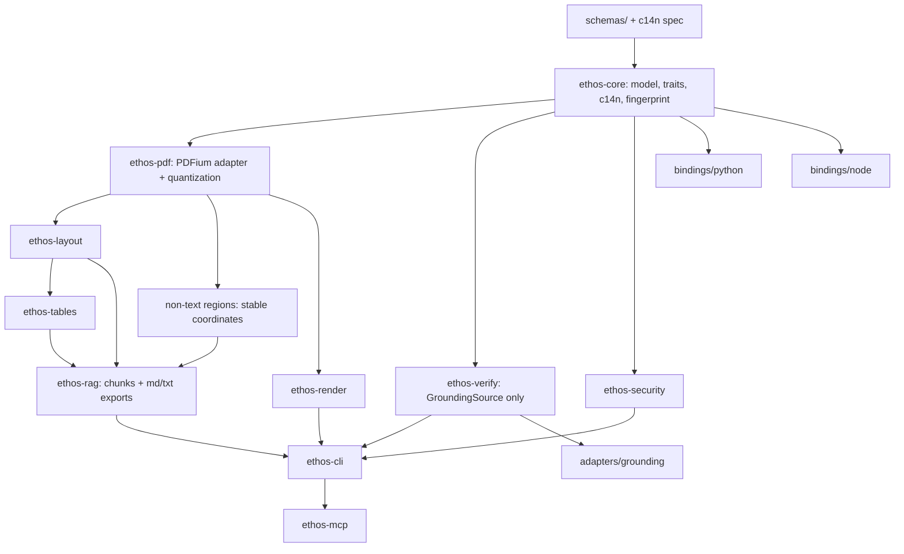

# Ethos Architecture

Governing documents: PRD v3.5 (`docs/DOCUSHELL_ATOM_OSS_PRODUCT_REQUIREMENTS.md`, source of
truth) and `docs/IMPLEMENTATION_PLAN.md`. Conflicts resolve PRD-first; changes by ADR.

Architectural principle (ADR-0007): Ethos is a verification and grounding layer that includes a
deterministic parser, not a parser that may later add verification.

## Public architecture (what users see)

```text
Ethos
├── ethos-doc      Document parsing, structure, and canonical document graph
├── ethos-rag      Chunking, citation references, and retrieval-ready artifacts
└── ethos-verify   Evidence, grounding, fingerprint, and citation verification
```

CLI mirrors this: `ethos doc parse`, `ethos rag chunk`, `ethos verify`, plus `ethos
fingerprint`, `ethos inspect`, `ethos debug`, `ethos audit`. Lower-level crate names are
internal engineering boundaries unless a package is explicitly published (ADR-0006).
Release 1 messaging is "document parsing and structure" — not broad "document understanding".

## Internal crate graph and build order



Pipeline stages (PRD §5.4): ingest → extract → normalize (quantize) → layout → tables →
regions → RAG → security → verify → render → export. Every export is derived from the
canonical graph + versioned config; Markdown is secondary.

## Invariants (enforced from commit one)

1. **Trust layer first.** `GroundingSource`, verification schemas, grounding adapters, and
   `ethos verify` are core architecture. The deterministic parser is one native grounding
   source and must not become the product boundary. Parser expansion does not outrank a working
   parser-agnostic verification path (ADR-0007).
2. **Quantize-at-extraction.** Geometry quantization happens in `ethos-pdf` before any
   heuristic consumes coordinates. Enforced by type: extraction emits `QuantizedGeom`
   (i64 quanta), never raw `f64` tuples. (`docs/determinism-contract.md` §4)
3. **Canonical payload vs envelope.** One c14n implementation in `ethos-core`; runtime
   diagnostics sit outside canonical equality; no crate hand-rolls output JSON.
4. **Backend isolation.** Only `ethos-pdf` links PDFium; `EthosPdfBackend` is the sole
   boundary; public schemas/APIs never expose PDFium types. Sandbox/subprocess mode is a
   backend implementation (PRD §6.3). The backend is swappable by design.
5. **Verify portability.** `ethos-verify` compiles against the `GroundingSource` trait module
   alone (`ethos-core` with `default-features = false`, feature `grounding`). CI builds it
   that way to prove no parser-internal dependency exists.
6. **No network in base** — three layers: (a) dependency policy (`deny.toml` bans
   network-capable crates), (b) static checks (`clippy.toml` disallowed `std::net` types and
   methods — catches what cargo-deny cannot), (c) runtime proof (CI runs the CLI under a
   network-denying sandbox and asserts zero egress).
7. **License boundary in base.** `deny.toml` allows only the ADR-0004 allowlist; copyleft /
   source-available / custom-condition / model-license-restricted dependencies are denied in
   the base tree. Optional restricted integrations live behind non-default features or
   separate packages with license manifests.

## Crate map (Release 1)

| Crate | Milestone | Role |
| --- | --- | --- |
| `ethos-core` | A | canonical model, IDs, errors/warnings, schema types, traits, c14n + fingerprint, page-range config |
| `ethos-pdf` | A | PDFium behind `EthosPdfBackend`; quantize-at-extraction lives here; font-mapper override (ADR-0003) |
| `ethos-verify` | B alpha, D v1 | parser-agnostic verification via `GroundingSource` only |
| `adapters/grounding/opendataloader-json` | A stub, B alpha, D v1 | first foreign-parser adapter; LiteParse/Docling candidates later |
| `ethos-layout` | B | reading order, blocks, headings, lists; md/txt exporters |
| `ethos-tables`, `ethos-rag`, `ethos-security`, `ethos-render` | C | tables; chunks+citations+regions; security report; crops/overlay |
| `ethos-cli` | A skeleton → | binary `ethos`, command groups `doc` / `rag` / `verify` |
| `ethos-mcp` | D | experimental MCP server, PRD §9.4 security rules |
| bindings: python | B | PyO3/maturin, stable surface |
| bindings: node | D | napi-rs, beta surface |

## Error and exit-code contract

Stable error codes (PRD §10) map 1:1 to CLI exit codes (`ethos-core::error`):

| Code | Exit | | Code | Exit |
| --- | --- | --- | --- | --- |
| success | 0 | | `ocr_required` | 8 |
| CLI usage error | 2 | | `unsupported_pdf_feature` | 9 |
| `invalid_pdf` | 3 | | `parse_timeout` | 10 |
| `corrupt_pdf` | 4 | | `memory_limit_exceeded` | 11 |
| `password_protected` | 5 | | `internal_error` | 12 |
| `page_limit_exceeded` | 6 | | | |
| `file_too_large` | 7 | | | |

Exit codes are a public contract from the first CLI release; changes are breaking.

## Determinism

See `docs/determinism-contract.md` (normative): c14n v1, ids-v1, quantization, fingerprint
formulas, config hash, warning determinism, test vectors, CI conformance.
